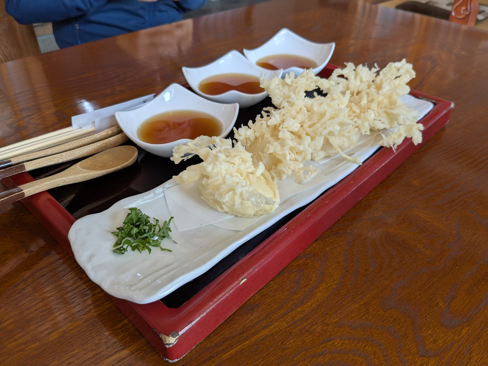
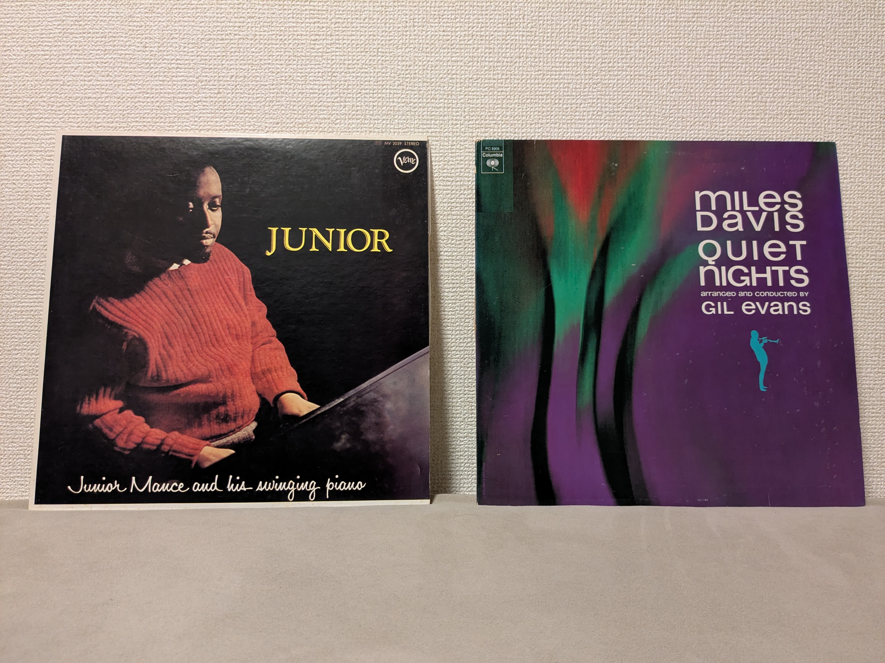
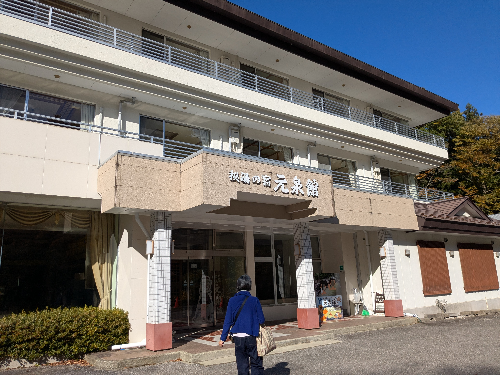
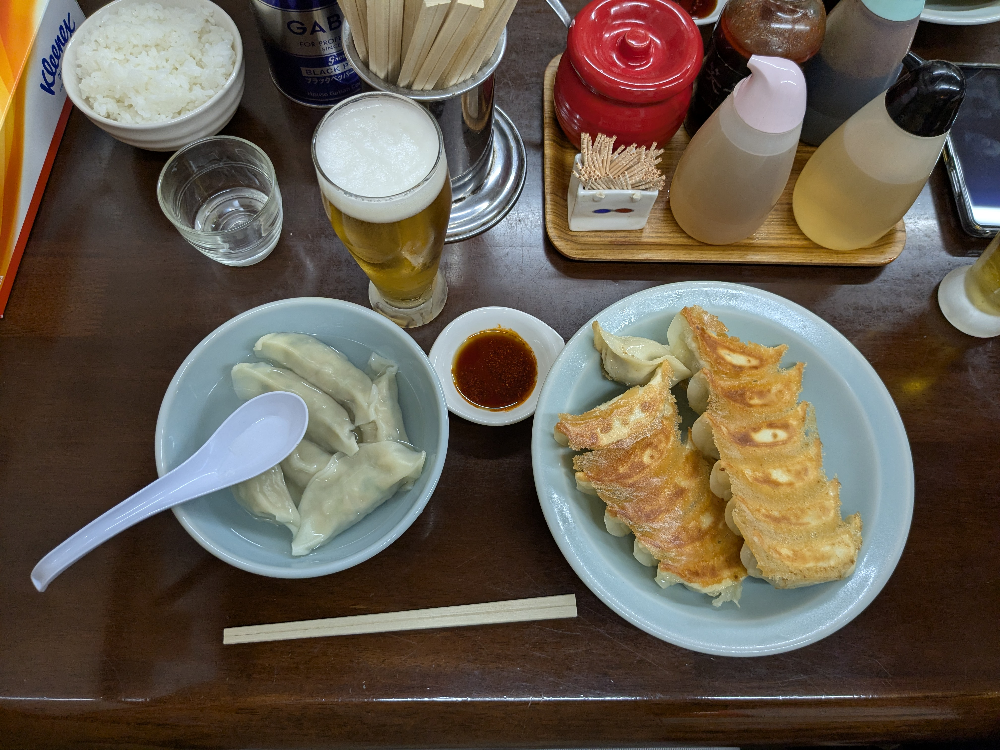
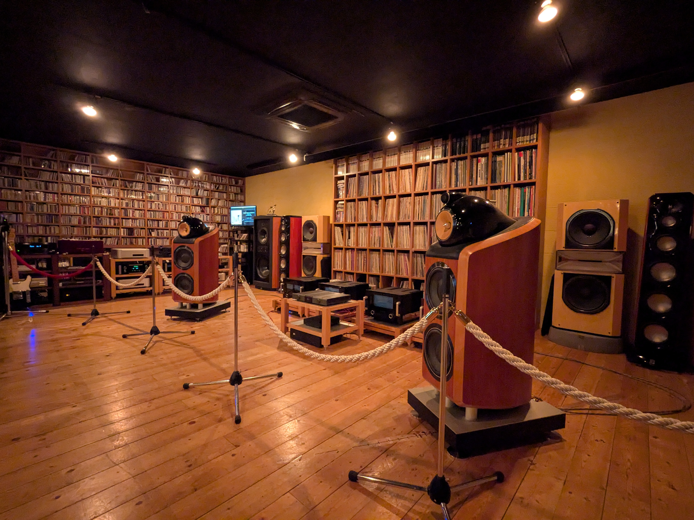
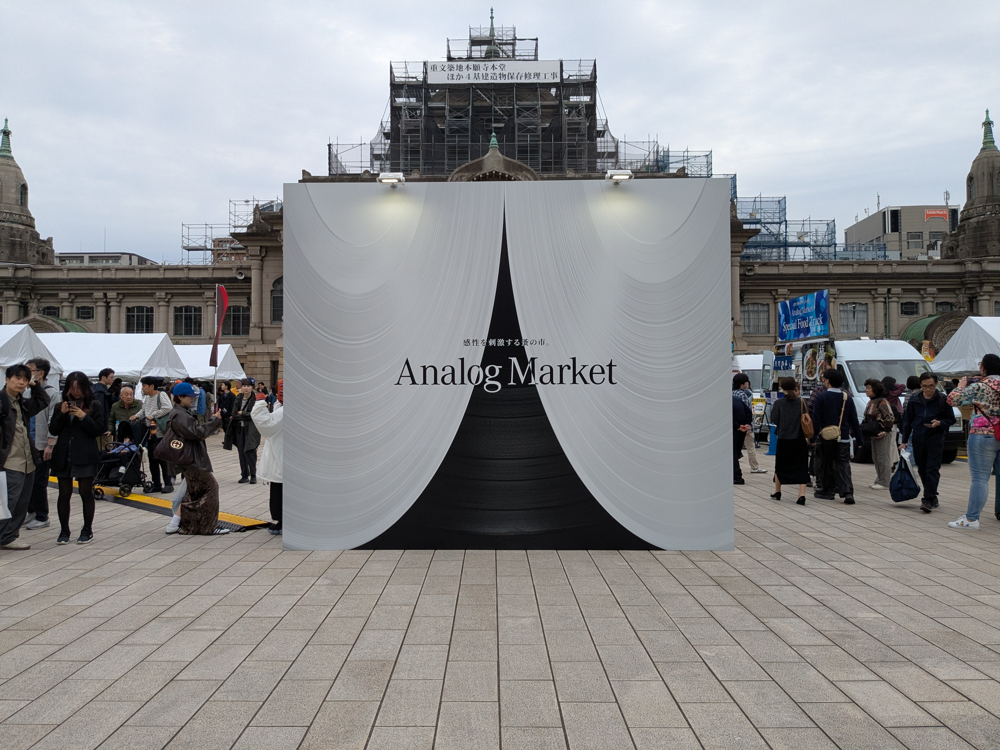
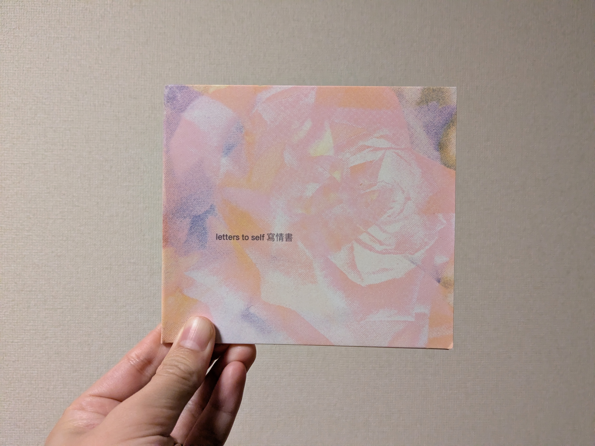

豆腐の天ぷら
{:.caption}

そば二種盛りと小海老のかき揚げ
{:.caption}

Vinyls bought at [Rokuyu](https://www.instagram.com/rokuyu20/)
{:.caption}

cafe shozo, milk tea
{:.caption}

元泉館 入口
{:.caption}

温泉前の渓谷
{:.caption}

紅葉
{:.caption}

宇都宮の餃子（餃子の笑平）
{:.caption}

[サウンドカフェ なかじ](https://jp.jbl.com/nakaji.html)
{:.caption}

Analog Market 2025, Tsukiji
{:.caption}

Letters to Self / yingtuitive
{:.caption}