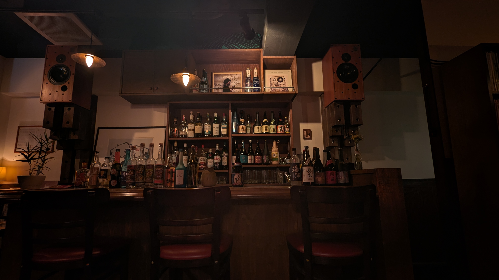

{:.no-cadre}

Enjoy music with some alcohol or good coffee.

### Yokohama

- [百万遍](https://www.instagram.com/hyaku_man_ben/) - blues & soul bar
- [LISTEN](https://www.instagram.com/listen_yokohama/) - SSW, black music, deep listening
- [rotary](https://www.instagram.com/rotary_bar/) - techno, ambient, jazz, etc. featuring mezcal
- [Antibody](https://bar-antibody.com/) - self-made speaker, jazz bar
- [Downbeat](http://www.yokohama-downbeat.com/) - a traditional jazz kissa since 1956
- [Essence](https://tabelog.com/kanagawa/A1401/A140102/14060260/) - soul bar
- [sakura taps](http://sakurataps.com/) - Craft beer, with original music playlists
- [Green Door](https://www.instagram.com/greendoor_chinatown/) - rare japanese jazz and pops, china town
- [Marshmallow](https://www.facebook.com/kissa.mashumaro1) - jazz kissa, china town
- [数寄者 数寄場](https://www.instagram.com/sukimono.sukiba/) - Nihonshu
- [N103](https://www.instagram.com/n103yokohama/) - agave bar, master being a DJ
- [Soul On](https://www.instagram.com/bar_soulon_yokohama/) - Soul bar
- [45 Yokohama](https://www.instagram.com/recordbar45yokohama/) - good music

### Tokyo

- [Music](https://www.instagram.com/bar_music_shibuya_tokyo/) - Shibuya, good music
- [tonlist](https://www.instagram.com/tonlist_tokyo/) - jazz cafe, great sound system
- [Masako](https://www.instagram.com/jazzkissamasako/), Shimokitazawa - jazz kissa
- [いーはとーぼ](https://www.instagram.com/cafe_ihatobo/), Shimokitazawa - jazz
- [Stillpark](https://www.stillpark.com/), Jiyugaoka - coffee, plants, music
- [rompercicci](http://www.rompercicci.com/), Nakano - jazz kissa
- [Slow Boat](https://www.slowboat.jp/), Yukigaya-Otsuka - jazz kissa
- [Olympus!](https://www.instagram.com/jazzolympus/), Ochanomizu - Jazz & Curry
- [DUG](http://www.dug.co.jp/) - Shinkuku, a jazz café in the basement.

### Other

- [Sound Cafe Nakaji](https://www.facebook.com/people/%E3%82%B5%E3%82%A6%E3%83%B3%E3%83%89%E3%82%AB%E3%83%95%E3%82%A7%E3%81%AA%E3%81%8B%E3%81%98/100063635497794/) (Kanuma, Tochigi) - Great Audio Spot
- [Rokuyu(六喩)](https://www.instagram.com/rokuyu20/)(Nasu) - selling records and other stuffs